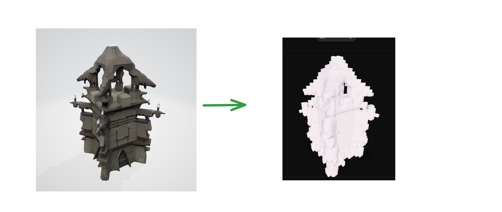

# voxelate

Text to 3D, with optional voxelization. Source mesh generation via [TRELLIS](https://github.com/microsoft/TRELLIS) (run through WSL2) before voxelizing it.



## Usage

Voxelize an existing mesh:

```bash
uv run python voxelate.py path/to/mesh.glb -o outputs/voxels.ply -p 0.02
```

- `-o, --out`: output voxel mesh file (`.ply` or `.binvox`)
- `-p, --pitch`: voxel edge length (smaller = higher resolution)

Generate a mesh from text and voxelize it in one step (requires WSL2 + a TRELLIS conda environment named `trellis`):

```powershell
./generate_voxels.ps1 -Text "a low poly fox" -Pitch 0.02
```

## How it works

`voxelate.py` loads a mesh with [trimesh](https://trimesh.org/), voxelizes it at the given pitch, fills the interior, and exports the result either as a `.binvox` voxel grid or as a triangulated mesh of boxes (`.ply` and other mesh formats).
